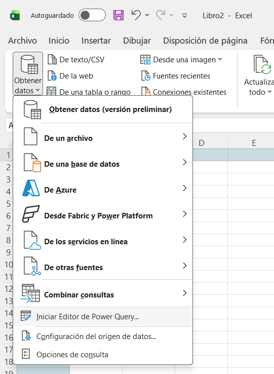
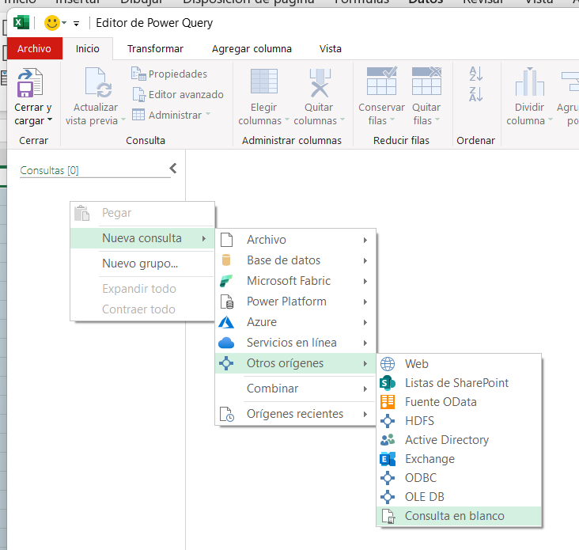
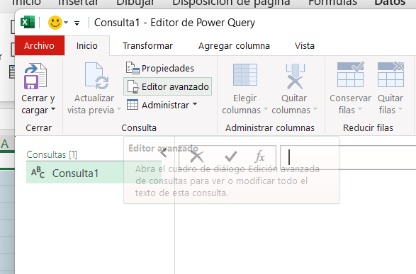
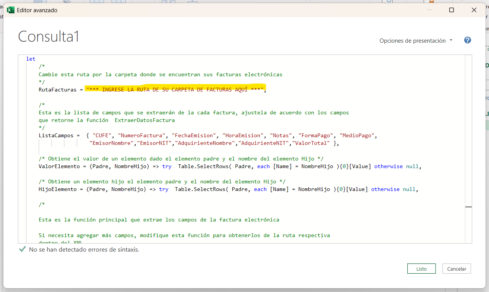
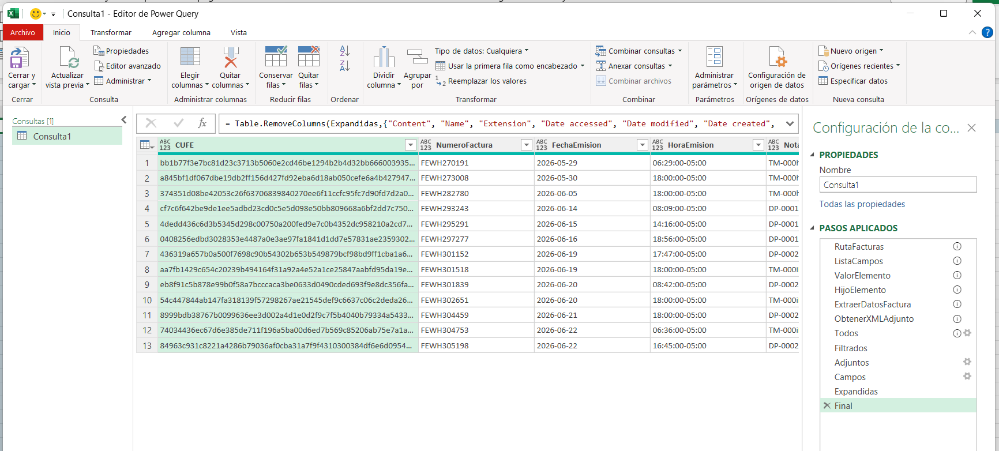

# powerquery

Fragmentos de código en lenguaje M de PowerQuery para consultar documentos electrónicos DIAN-XML desde Excel o Power BI

Cortesía de Creativos Digitales S.A.S.  https://creativosdigitales.co

Si tiene dudas sobre facturación electrónica, sobre el uso de estos scripts o quiere proponer alguna funcionalidad nueva, puede hacerlo a través de https://facturasyrespuestas.com

También está invitado a participar en la construcción de este repositorio. Síentase en libertad de escribir a través de la funcionalidad de Issues o Mensajes directos.

Le invitamos a unirse a nuestra Comunidad en Whatsapp en el siguiente enlace: 

## Requisitos

- Debe contar con una versión de Excel que incluya Power Query o power Bi Desktop. Las instruciones en esta página aplican para Excel, pero el procedimiento en Power BI es 
muy similar.

- Previamente debe tener descargadas en formato XML las facturas desde el portal de la DIAN o desde su correo y extraidas de los archivos ZIP. Por ahora el script no puede leer archivos ZIP.

- Esta utilidad no lee representaciones gráficas en PDF, solo documentos electrónicos en formato XML.

- Funciona con Facturas electrónicas, Notas, Documentos Soporte y Documentos Equivalentes. Para Nómina Electrónica, esperamos liberar un nuevo script próximamente.

## Uso del script:

Desde la pestaña **Datos**, abra el menú **Obtener Datos** y seleccione **Iniciar Editor de PowerQuery** para abrir directamente el editor de PowerQuery.  



Sobre el panel de consulta de la izquierda, haga click Derecho con el ratón seleccione la opción **Nueva Consulta - Otros orígenes - Consulta en Blanco**  



En la pestaña **Inicio** , seleccione el botón **Editor avanzado**



Se abrirá el editor del Lenguaje M de PowerQuery, copie el contenido del archivo [ImportarCarpetaFE.m] en este repositorio y péguelo en el editor de código.

Asegúrese de cambiar el valor de la variable **RutaFacturas** por la ruta de la carpeta donde tiene descargadas las facturas en XML



Haga click en el botón **Listo** para guardar el script. Y luego haga click en **Guardar y Cerrar** para retornar el resultado a la hoja actual en Excel.



## Solución de Problemas

```
DataSource.NotFound: File or Folder: We couldn't find the folder '*** INGRESE LA RUTA DE SU CARPETA DE FACTURAS AQUÍ ***'. 
```

**Causa** : No se ha indicado la ruta correcta de la carpeta que contiene los archivos XML.

**Solución** : Edite el primer paso del script donde se asigna la variable *RutaFacturas* y verifique que la ruta de su carpeta sea correcta.

```
La lista de resultados está vacía
```

**Causa** : La carpeta indicada no contiene archivos XML, posiblemente solo contiene archivos ZIP.

**Solución** :  Asegúrese de desempacar los archivos ZIP y ponerlos en formato XML en la carpeta.

```
La lista de resultados contiene la palabra `Error` en todas las celdas 
```

**Causa** : Hay un archivo con formato incorrecto en la carpeta.

**Solución** :  Verifique cada uno de los archivos XML en la carpeta, para asesgurarse que si correspondan a 
documentos electrónicos en formato XML-DIAN.

Si tiene un problema diferente, puede formularlo en nuestro portal https://facturasyrespuestas.com o 
en nuestro grupo de Whatsapp 

## Autores

William David Velásquez [ProfeBill](https://github.com/ProfeBill)

Copyright (c) 2026 [Creativos Digitales S.A.S.](https://creativosdigitales.co)